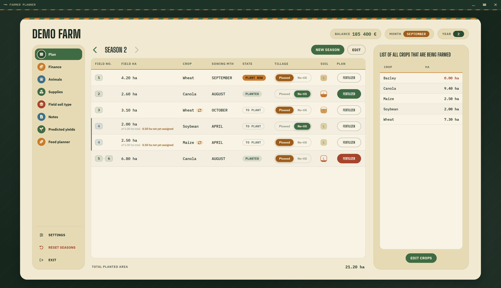
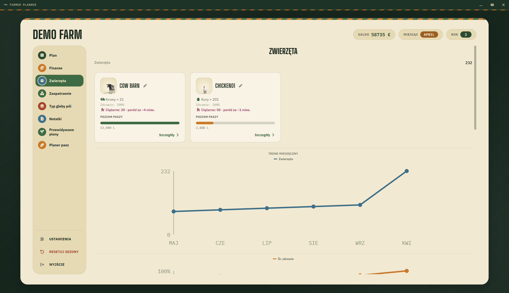

<p align="center">
  
</p>

<p align="center">
  A season planner for <b>Farming Simulator 25</b> — fields, crops, fertilization, animals and feed in one place,<br>
  kept in sync with your savegame.
</p>

<p align="center">
  <b>English</b> | <a href="README.pl.md">Polski</a>
</p>

---



## Features

**Season plan**
- Field table: field number (several fields can be combined into one row, e.g. `69-70-71`), hectares, crop, sowing month, state (to plant / plant now / planted), plowed or no-till, soil type and a per-field fertilization plan. Click a column header to sort.
- Catch crops (green rye, oilseed radish…) on the same field, before or after the main crop.
- Seasons with history — step back to previous seasons and compare.
- Crops summary: total hectares per planted crop, filled in from the fields, in the game's crop order (or sorted by name / area); catch crops listed separately.
- Optional whole land plot (farmland) area next to each field's area.
- Crop rotation warnings.

**Game sync**
- Imports balance, loan, playtime, equipment and animals from `careerSavegame.xml` — loans from the Enhanced Loan System and Bank And Credit mods included.
- Auto-sync while you play — the planner refreshes every time the game saves (manual save or autosave).
- The map's crops, their order and sowing calendar read automatically from the map mod the savegame uses — no folder import needed (a map folder can still be picked for maps the app can't read).
- Animal mods that change feed consumption are detected: **AnimalFoodCalculator** (mode, multiplier, days per month, reference curves) and **EnhancedAnimalSystem** (lactation food factor).
- Field soil types from Precision Farming, read straight from the savegame.

**Tools (left sidebar)**
- **Finance** — balance and loan month by month and season by season.
- **Animals** — one tile per building, breed pictures taken from your mods, herd by breed and age, feed level and how many days it lasts, daily needs, output, and reproduction (pregnancy progress, months to birth, animals not inseminated or too young). Buildings can be renamed.
- **Supplies** — how much seed and fertilizer to buy for the season.
- **Field soil type** — field soils used by the fertilization plans.
- **Notes** — pinned to months, with tags and a checklist.
- **Predicted yields**.
- **Feed planner** — what you have, what's missing and how many hectares to sow to feed your herd, plus a **mixer wagon** calculator: load it from the bales on your farm and check the mix against the game's TMR recipe. Feed mixer productions (pig food, TMR, mineral feed) are detected with their stock, recipes and monthly output.

**Other**
- English and Polish.
- Interactive tutorial (app settings → "Open tutorial").
- Farm backups (export / import).
- Discord Rich Presence — shows your current farm on your profile (can be turned off).



## Installation

Download the Windows installer from the [Releases](https://github.com/WiktorParylak/farmer-planner/releases) page and run it — nothing else needs to be installed.

### Running from source (developers only)

Only needed if you want to change the code or build the installer yourself. Requires [Node.js](https://nodejs.org/) 20 or newer.

```bash
git clone https://github.com/WiktorParylak/farmer-planner.git
cd farmer-planner
npm install
npm start
```

Build the installer (into `dist/`):

```bash
npm run build
```

## Getting started

1. Click **ADD FARM +** and enter the farm and map name.
2. Open the farm and click **Settings** in the left sidebar.
3. Point it to your savegame, e.g.
   `Documents\My Games\FarmingSimulator2025\savegame1\careerSavegame.xml`
   and turn on auto-sync.
4. (Optional) pick the animal definitions folder if your map or mods add their own breeds. The map's crops are read automatically from the savegame; pick a map folder only if they aren't (base-game map, mod not found).
5. Click **SAVE & IMPORT**.

Mods are looked up in the `mods` folder next to your savegame, in the folder set in the game's `gameSettings.xml`, and in your FSG Mod Assistant collections. Breed pictures are loaded automatically from there. Base-game animals (packed inside the game's archives) are shown as icons.

## Where your data lives

Farms are stored in `Documents\Farmer Planner`, so they're easy to find, copy or sync. The app only **reads** game files and never modifies them.

## Project structure

```
src/
  main/        Electron main process (window, dialogs, Discord Rich Presence)
  renderer/    UI: index.html, renderer.js, style.css, savegame & mod readers
data/          Bundled base-game data (default crops, animals, nitrogen by soil)
Assets/        Logo and app icon
tools/         Dev scripts that regenerate the files in data/ from game files
docs/          Screenshots and notes
```

## Built with

[Electron](https://www.electronjs.org/), plain HTML/CSS/JavaScript, [Font Awesome](https://fontawesome.com/).

## Changelog

See [CHANGELOG.md](CHANGELOG.md) or the [Releases](https://github.com/WiktorParylak/farmer-planner/releases) page.

## Author

Wiktor Parylak
